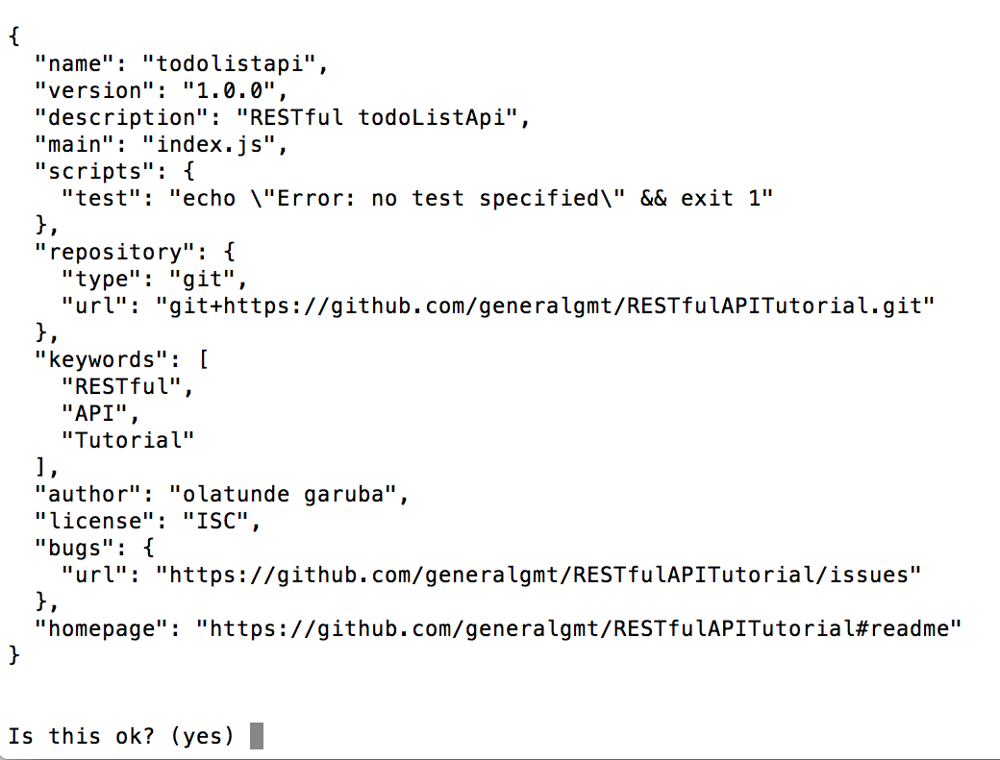
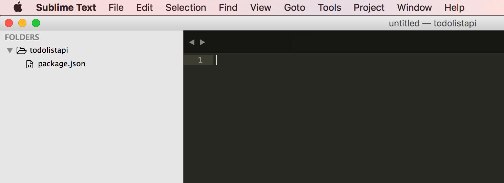
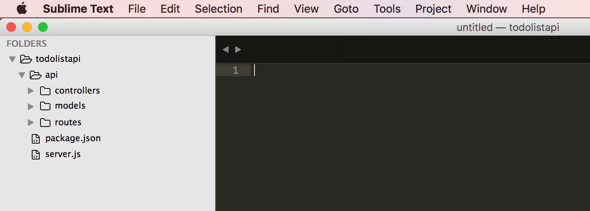
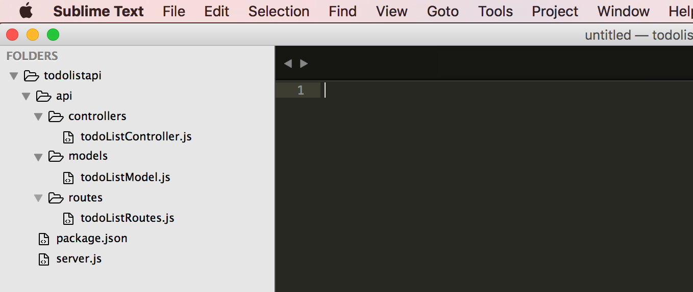
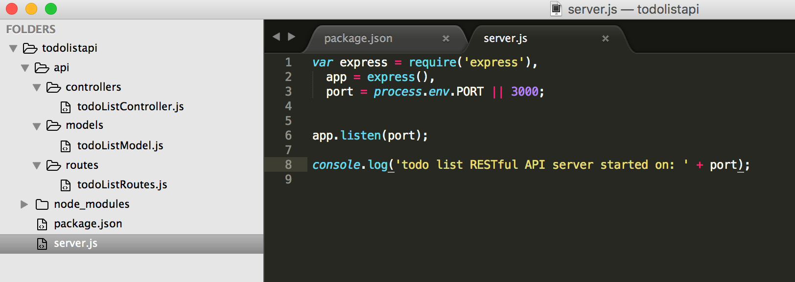
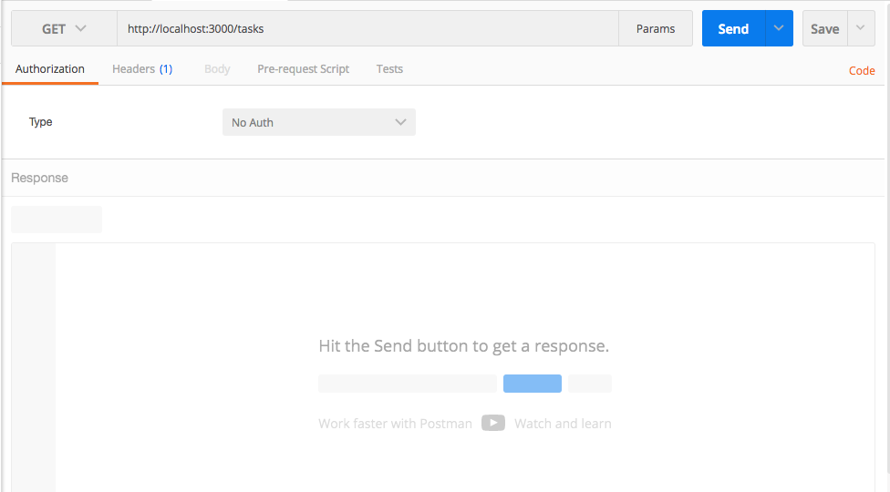
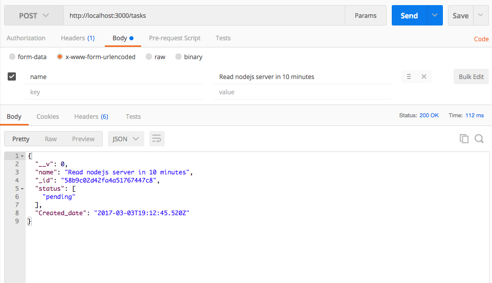

原文链接：[Build Node.js RESTful APIs in 10 Minutes](https://www.codementor.io/olatundegaruba/nodejs-restful-apis-in-10-minutes-q0sgsfhbd)

作者：Olatunde Garuba

## 什么是REST?

[REST](https://www.codementor.io/restful/tutorial/rest-api-design-best-practices-strategy)是Representational State Transfer的缩写。它是Web标准架构和HTTP协议。REST架构风格描述了Roy Fielding在博士论文中最初表达的六个限制，并将RESTful风格的基础定义为：

1. 统一的界面
2. 无状态
3. 可缓存
4. 客户端服务器
5. 分层系统
6. 按需编码

RESTful的应用程序使用HTTP执行四种操作CRUD（C：create，R：read，U：update，D：delete）。Create和Update用来提交数据，get来读取数据，delete用来移除数据。

RESTful由基本URL，URL，媒体类型等组成。

在本教程中，我们将学习如何用Node.js创建REST风格的API。

## 工具：

- Node.js
- MongoDB
- 编辑器（Atom、Sublime等）（了解更多，请阅读[Best Text Editor? Atom vs Sublime vs Visual Studio Code vs Vim](https://www.codementor.io/mattgoldspink/best-text-editor-atom-sublime-vim-visual-studio-code-du10872i7)）
- [Postman](https://www.getpostman.com/)

## 开始

本文的目的是说明创建一个REST风格的API。为了达到这个目的，我们将会创建REST风格的[todo list API](https://github.com/generalgmt/RESTfulAPITutorial)（最终的可以创建任务、读取所有任务的列表、读取一个特定的任务、删除任务以及更新任务）。

## 假设

假设大家都装好了需要的环境（例如：已经安装好了[Node.js](https://www.codementor.io/mercurial/how-to-install-node-js-on-macos-sierra-mphz41ekk)和MongoDB）。

运行npm -v 和 mongo --version，你可以看到你安装的NPM和MongoDB的版本。

如果你还没有安装，可以看[这里](https://nodejs.org/en/download/package-manager/)来了解如何安装并且用Node和[MongoDB](https://docs.mongodb.com/manual/installation/)创建一个server。

如果你已经安装好了，那我们就开始吧。

打开你的终端并且进行以下步骤：
1. 创建一个todoListApi文件夹
```
mkdir todoListApi
```
2. 转入你刚刚创建的目录
```
cd todoListApi
```
3. 创建package.json文件
```
npm init
```
Package.json文件告诉了npm必要的信息，让npm可以识别项目，同时处理项目的依赖。

npm初始化将会提示你输入一些必要信息，比如说app名称、描述、版本、作者、关键字以及你是否相应看见你喜欢的。

你将会看到类似于下面这样的结果：


输入yes，按下enter键来完成package.json文件的创建。

做完这些之后，你的文件目录看起来应该像是这样子的：


4. 创建server.js文件
```
touch server.js
```
在这个server中，我们将会写下创建我们server的代码。
5. 创建一个api文件夹
```
mkdir api
```
在这个api文件夹中，创建三个独立的models、routes、以及controllers文件夹
```
mkdir api/controllers api/models api/routes
```

6. 在api/controller文件夹中创建todoListController.js文件，在routes文件中创建todoListRoutes.js文件，在models文件夹中创建todoListModel.js文件
```
api/controllers/todoListController.js 
api/models/todoListModel.js 
api/routes/todoListRoutes.js
```
我们的文件目录应该像下面这样：


## Server安装

现在来安装express和nodmon，express用来创建server，nodmon帮助我们追踪我们应用程序的改变，它会监视文件的改变并且自动重启server。
```
npm install --save-dev nodemon
npm install express --save
```
一旦成功安装之后，你的package.json文件将会被修改，添加两个新的依赖：
1. 打开package.json文件，并且把这个任务添加到文件中。

2. 打开server.js文件，输入/复制以下的代码：
```
var express = require('express'),
  app = express(),
  port = process.env.PORT || 3000;

app.listen(port);

console.log('todo list RESTful API server started on: ' + port);
```

3. 在你的终端中运行npm run start，启动你的server，你将会看到。

## 安装数据库模式
首先，我们要安装mongoose
```
npm install mongoose --save
```
### 为什么是Mongoose？
Mongoose是我们用来与MongoDB数据库交互的工具。

安装之后，打开todoListModel.js文件，输入以下代码并且保存：
```
'use strict';
var mongoose = require('mongoose');
var Schema = mongoose.Schema;


var TaskSchema = new Schema({
  name: {
    type: String,
    Required: 'Kindly enter the name of the task'
  },
  Created_date: {
    type: Date,
    default: Date.now
  },
  status: {
    type: [{
      type: String,
      enum: ['pending', 'ongoing', 'completed']
    }],
    default: ['pending']
  }
});

module.exports = mongoose.model('Tasks', TaskSchema);
```
通过上面的代码，我们在我们的文件导入了mongoose，我们创建了一个模型，说明我们的数据集应该呈现的样子。

正如你所看到的，它指出了数据集（表）应该包含一个名称，它的类型应该是string，还包括了创建日期。它也包含了任务状态，每个任务被创建的时候都有默认值pending。

## 安装路由

路由决定了应用程序如何响应特定终端的客户端的请求，一个特定的URL（或path）以及特定的HTTP请求（GET、POST等等）。

每个路由都有不同的路由处理方法，当路由匹配时被执行。

下面我们将会用不同的方法定义两个基本的路由（“tasks”以及“/tasks/taskId”）。

“/tasks”有POST和GET方法，“/tasks/taskId”有GET、PUT和DELETE方法。

正如你所看到的，我们需要controller，每个路由方法都能调用它对应的处理程序。
```
'use strict';
module.exports = function(app) {
  var todoList = require('../controllers/todoListController');


  // todoList Routes
  app.route('/tasks')
    .get(todoList.list_all_tasks)
    .post(todoList.create_a_task);


  app.route('/tasks/:taskId')
    .get(todoList.read_a_task)
    .put(todoList.update_a_task)
    .delete(todoList.delete_a_task);
};
```
## 安装控制器
打开todoListController.js文件，然后进行下一步：

在这个controller中，我们将会写出5个不同的方法：list_all_tasks， create_a_task，read_a_task，update_a_task， delete_a_task。我们将会到处每个方法。

每个方法会用到不同的mongoose方法，例如find、findById、findOneAndUpdate、save 以及 remove。
```
'use strict';


var mongoose = require('mongoose'),
  Task = mongoose.model('Tasks');

exports.list_all_tasks = function(req, res) {
  Task.find({}, function(err, task) {
    if (err)
      res.send(err);
    res.json(task);
  });
};


exports.create_a_task = function(req, res) {
  var new_task = new Task(req.body);
  new_task.save(function(err, task) {
    if (err)
      res.send(err);
    res.json(task);
  });
};


exports.read_a_task = function(req, res) {
  Task.findById(req.params.taskId, function(err, task) {
    if (err)
      res.send(err);
    res.json(task);
  });
};


exports.update_a_task = function(req, res) {
  Task.findOneAndUpdate(req.params.taskId, req.body, {new: true}, function(err, task) {
    if (err)
      res.send(err);
    res.json(task);
  });
};


exports.delete_a_task = function(req, res) {


  Task.remove({
    _id: req.params.taskId
  }, function(err, task) {
    if (err)
      res.send(err);
    res.json({ message: 'Task successfully deleted' });
  });
};
```
## 结合所有的东西
1. 连接数据库，添加连接mongoose实例的url。
2. 加载创建的model - task。
3. 安装bodyParser使用bodyParser在处理之前先在中间层解析请求中的body，在req.body属性。

它暴露了各种工厂来创建中间件。如果没有body来解析或者空对象（{}），中间件将会使用解析的req.body属性来填充。
4. 在服务中注册我们创建的路由。
```
var express = require('express'),
  app = express(),
  port = process.env.PORT || 3000,
  mongoose = require('mongoose'),
  Task = require('./api/models/todoListModel'),
  bodyParser = require('body-parser');
  
mongoose.Promise = global.Promise;
mongoose.connect('mongodb://localhost/Tododb'); 


app.use(bodyParser.urlencoded({ extended: true }));
app.use(bodyParser.json());


var routes = require('./api/routes/todoListRoutes');
routes(app);


app.listen(port);


console.log('todo list RESTful API server started on: ' + port);
```
5. 启动MongoDB服务
打开你的终端，运行
```
mongod
```
这将会开启你的MongoDB服务，node服务就可以连接到MongoDB实例。一旦你的MongoDB服务运行，在nodemon终端中运行：rs 重启你的node服务。

## 通过Postman测试
现在所有的都连接在一起了，让我们来测试每一个路由以及相应的方法。

打开你的postman，进行以下步骤：

1. 输入http://localhost:3000/tasks，按下enter键。



按下enter键之后，只会看到“[]”，因为数据库中还没有数据。

2. 还是同样的地址，但是改变为POST方法，点击body，选择“x-www-form-urlencoded”。

然后，输入名称作为键，以及相应的任务作为值。

然后，点击发送按钮。

应该会有一个200 ok的响应。



## 增加一个中间层
做完所有的这些之后，如果我们输入一个错误的路由会怎么样呢？假如说你输入“http://localhost:3000/task”，响应是“Cannot GET /task”。添加express中间层，能够返回更多的交互信息。

中间层会拦截传入的http请求，因此可以使用它们来执行多个操作，从验证到认证等等。
```
app.use(function(req, res) {
  res.status(404).send({url: req.originalUrl + ' not found'})
});
```
上面这个代码片段是用来帮助在网站被输入错误请求时进行重定向和响应的。

 


